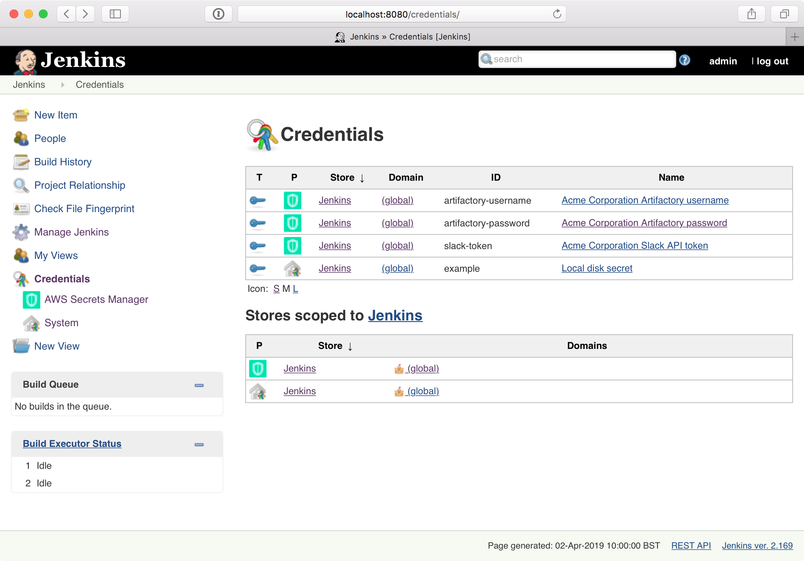

# AWS Secrets Manager Credentials Provider Plugin

[](https://ci.jenkins.io/blue/organizations/jenkins/Plugins%2Faws-secrets-manager-credentials-provider-plugin/activity/)
[](https://plugins.jenkins.io/aws-secrets-manager-credentials-provider)

Access credentials from AWS Secrets Manager in your Jenkins jobs.

- [CI Build](https://ci.jenkins.io/blue/organizations/jenkins/Plugins%2Faws-secrets-manager-credentials-provider-plugin/)
- [Issues](https://issues.jenkins-ci.org/issues/?jql=component+%3D+aws-secrets-manager-credentials-provider-plugin)

## Features

- Read-only view of Secrets Manager.
- Credential metadata caching (duration: 5 minutes).
- Jenkins [Configuration As Code](https://github.com/jenkinsci/configuration-as-code-plugin) support.

Settings:

- Filters
  - Filter secrets by tag
- Endpoint Configuration
  - Service Endpoint
  - Signing Region

## Setup 

### Jenkins

Install and configure the plugin.

### AWS IAM

Give Jenkins an [IAM policy](https://docs.aws.amazon.com/secretsmanager/latest/userguide/auth-and-access_identity-based-policies.html) with read access to AWS Secrets Manager.

Required permissions:

- `secretsmanager:GetSecretValue` (resource: `*`)
- `secretsmanager:ListSecrets`

Optional permissions:

- `kms:Decrypt` (if you use a customer-managed AWS KMS key to encrypt the secret)

### AWS Secrets Manager

Upload secrets to AWS Secrets Manager in the format "one secret value = one AWS Secret" (see the [AWS documentation](https://docs.aws.amazon.com/cli/latest/reference/secretsmanager/create-secret.html)).

Text:

```bash
aws secretsmanager create-secret --name 'newrelic-token' --description 'Acme Corp Newrelic API token' --secret-string 'abc123'
```

Username + Password:

```bash
aws secretsmanager create-secret --name 'artifactory-username' --description 'Acme Corp Artifactory username' --secret-string 'joe'
aws secretsmanager create-secret --name 'artifactory-password' --description 'Acme Corp Artifactory password' --secret-string 'supersecret'
```

SSH key:

```bash
ssh-keygen -t rsa -b 4096 -C 'acme@example.com' -f id_rsa
aws secretsmanager create-secret --name 'ssh-key' --description 'Acme Corp SSH key' --secret-string 'file://id_rsa'
```

## Usage 

Reference a secret in Secrets Manager by its name in a build job:

```groovy
pipeline {
    environment {
        ARTIFACTORY_USERNAME = credentials("artifactory-username")
        ARTIFACTORY_PASSWORD = credentials("artifactory-password")
    }
    stages {
        stage("Deploy") {
            sh "mvn deploy"
        }
    }
}
```

## Configuration

The plugin's default behavior requires **no configuration**.

### Web UI

You can set plugin configuration using the Web UI.

Go to `Manage Jenkins` > `Configure System` > `AWS Secrets Manager Credentials Provider` and change the settings.

### Configuration As Code (CasC)

You can set plugin configuration using Jenkins [Configuration As Code](https://github.com/jenkinsci/configuration-as-code-plugin).

```yaml
unclassified:
  awsCredentialsProvider:
    filters:
      tag:
        key: product
        value: roadrunner
    endpointConfiguration:
      serviceEndpoint: http://localhost:4584
      signingRegion: us-east-1
```

## Bugs

- All secrets must be uploaded via the AWS CLI or API. This is because the AWS Web console *currently* insists on wrapping your secret string in JSON.
- All secrets must be in "secret string" format (not "secret binary") as Jenkins will parse them into (UTF-8) string credentials. You can base64 encode a binary secret to work around this.

## Development

### Dependencies

- Docker
- Java
- Maven

### Build 

In Maven:

```bash
mvn verify
```

In your IDE:

1. Generate translations: `mvn localizer:generate`. (This is a one-off task. You only need to re-run this if you change the translations, or if you clean the Maven target directory.)
2. Compile.
3. Start Moto: `mvn docker:build docker:start`.
4. Run tests.
5. Stop Moto: `mvn docker:stop`.

## Screenshots


